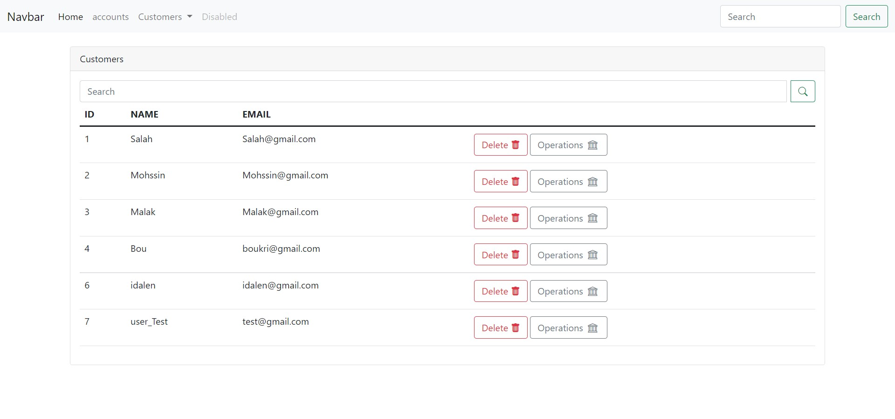
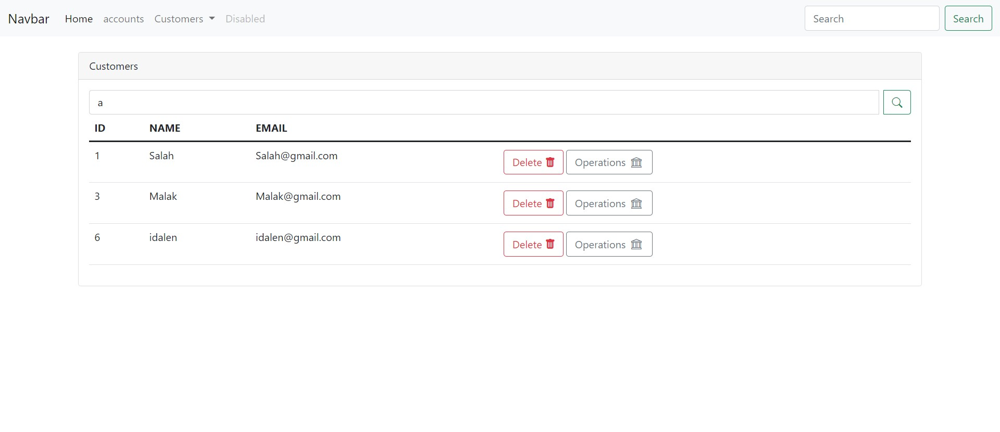
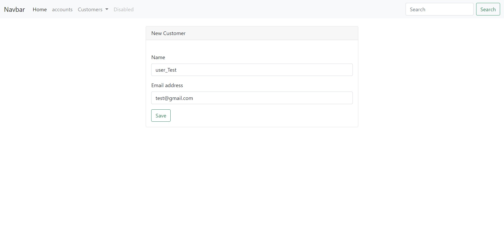
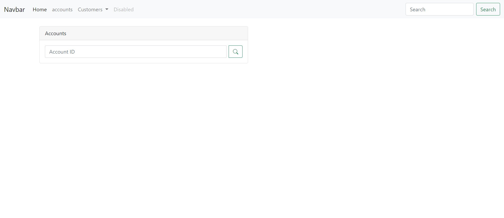
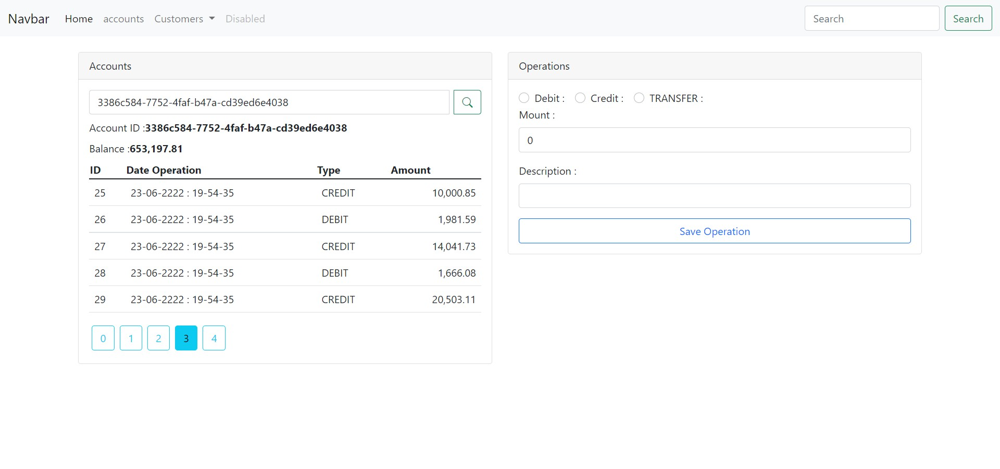
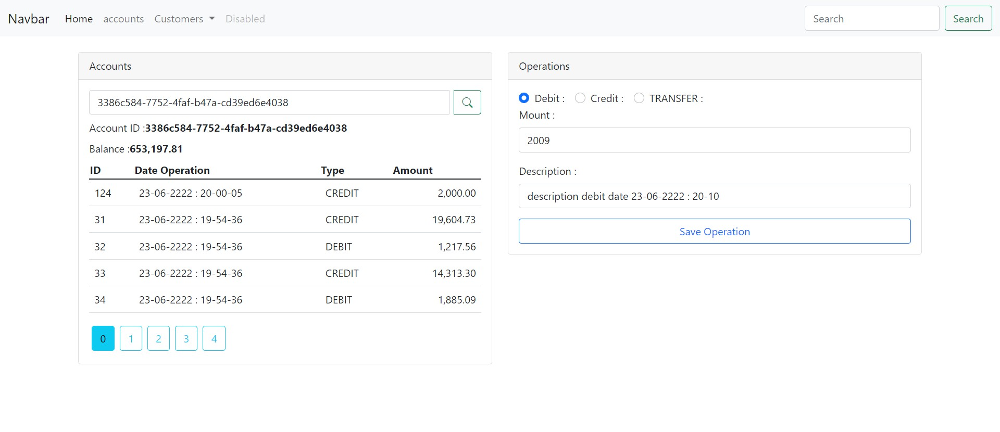
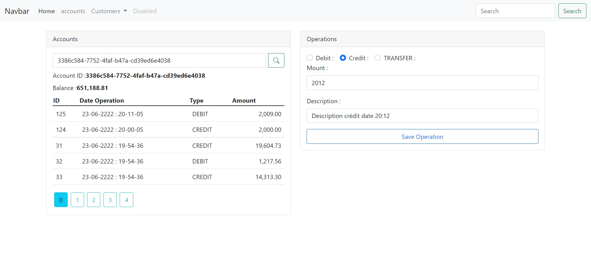
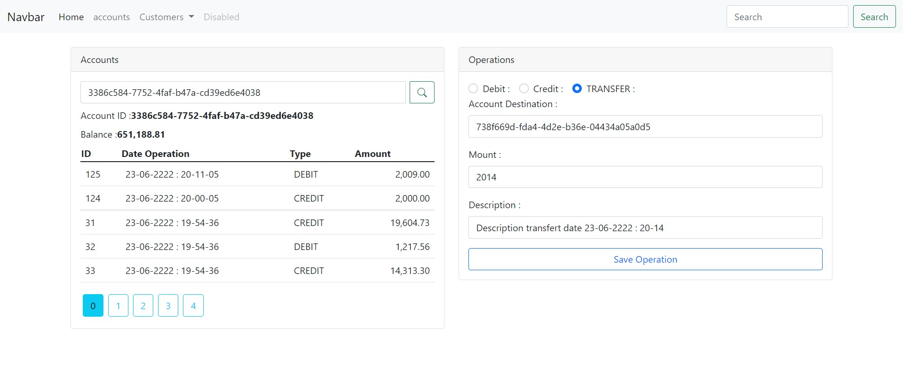

<h2><u>Report</u></h2>
<h3>front-end part for digital banking web application using Angular </h3>

<ul>

<h3 style="color: red">Customers</h3>

    <ol> </ol>
    <ol style="text-align: center"><strong style="color: red">Figure 1: </strong> List of Customers</ol>
    <ol> </ol>
    <ol style="text-align: center"><strong style="color: red">Figure 2: </strong>Search Customer</ol>
    <ol> </ol>
    <ol style="text-align: center"><strong style="color: red">Figure 3: </strong>Add Customer</ol>
<h3 style="color: red"><u>Accounts </u></h3>
    

      <ol> </ol>
      <ol style="text-align: center"><strong style="color: red">Figure 4: </strong> Before enter account_ID</ol> 
      <ol></ol>
      <ol style="text-align: center"><strong style="color: red">Figure 5: </strong> After enter account_ID</ol>
      <ol> </ol>
      <ol style="text-align: center"><strong style="color: red">Figure 6: </strong> Operation DEBIT </ol>
      <ol> </ol>
      <ol style="text-align: center"><strong style="color: red">Figure 7: </strong> Operation CREDIT </ol>
      <ol> </ol>
      <ol style="text-align: center"><strong style="color: red">Figure 8: </strong> Operation Transfer </ol>

</ul>

